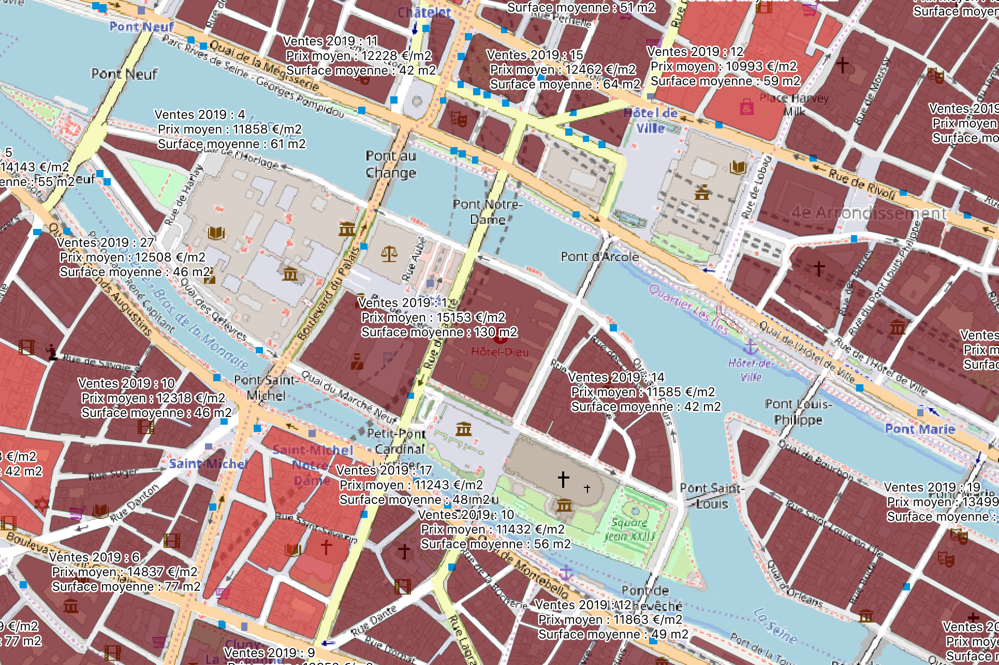

# Valeurs foncières to Shapefile

This repository contains simple python classes to import and generate shapefiles that can be loaded and analysed in your favorite GIS software (ie Qgis).

The data comes from the french administration
- [Etalab's Cadastre](https://cadastre.data.gouv.fr/data/etalab-cadastre/)
- [Demandes de valeurs foncières (DVF)](https://www.data.gouv.fr/fr/datasets/demandes-de-valeurs-foncieres/)

See the jupyter notebook for more details.

